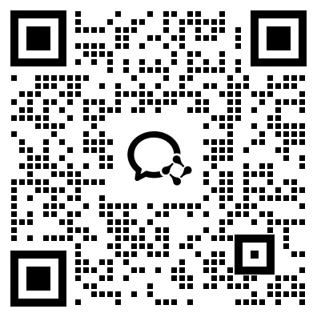

# Embodied-AI-Challenge-AMD-Platform-2026-09

[中文版本](./README.md)

# Ant Lingbot Embodied Foundation Model Challenge · AMD Contest-Dedicated Compute Claim Guide

This page explains how to obtain AMD Radeon GPU compute resources for the Ant Lingbot Embodied Foundation Model Challenge and the AMD benefits available to participating developers.

As a strategic partner of this contest, AMD is providing additional development resources for participating teams with GPU compute needs: contest-dedicated compute on the Radeon Cloud platform together with the ROCm open-source AI software stack. These resources help developers complete model post-training on AMD platforms and perform Robotwin task evaluation. Eligible participants may voluntarily apply for AMD compute support during the contest.

The compute resources are strictly limited to this contest. If they are found to be used for other purposes, access to the compute platform will be revoked.

### For AMD GPU compute inquiries, scan the QR code to contact the AMD Compute Support Team.

## 1. How to obtain AMD Radeon GPU resources

### Step 1: Complete contest registration

Contest entrance: https://tianchi.aliyun.com/competition/entrance/532514

### Step 2: Complete AMD Developer Program registration

Alternatively, visit the following link to complete AMD Developer Program (ADP) registration:

https://developer.amd.com.cn/login?source=sSEUZ7cAA

### Step 3: Join the official contest group

After completing contest registration and ADP registration, join the official contest group to obtain the compute application entry and follow-up notices.

### Step 4: Have a team representative submit the GPU resource request

After completing contest registration, AMD Developer Program registration, and joining the official contest group, a team representative may apply for the contest-exclusive Radeon GPU resources. The application must provide the AMD ADP member ID.

> **Important:** AMD will provide eligible contest teams with dedicated Radeon GPU credits so that teams can participate in contest development and testing without preparing their own training compute resources. For detailed compute application and usage rules, see the [AMD Compute Application and Usage Rules](./Radeon-Cloud-User-Guide/AMD_VLA_Contest_Compute_Rules_en.md).

Compute platform availability: **September 15, 2026, 14:00 to October 26, 2026, 20:00**. The baseline resource provision is **200 GPUs**; the available scale may be adjusted dynamically according to event priorities at later stages.

## 2. Radeon Cloud User Guide

For Radeon Cloud login, instance configuration, JupyterLab usage, and instance destruction, see the [Radeon Cloud User Guide](./Radeon-Cloud-User-Guide/README_en.md).

AMD Radeon GPUs can be used for:

- Robotwin task evaluation
- Reproducing and training the LingBot-VLA 2.0 model

## Robotwin Reference

You can refer to [Robotwin-radeon-cloud](https://github.com/ZiguanWang/Robotwin-radeon-cloud) to run simple Robotwin experiments on Radeon Cloud, including:

- Robotwin closed-loop benchmark: run closed-loop tasks and evaluate robot policy performance.
- LoRA training: perform parameter-efficient fine-tuning with LoRA.
- Full-parameter SFT training: perform supervised fine-tuning with all model parameters.

Refer to the example repository for the exact environment setup, data preparation, training commands, and evaluation procedures.

## 3. AMD Developer Benefits Overview

| Benefit | Description |
| --- | --- |
| Dedicated compute | Every eligible contest team may receive AMD Radeon GPU credits |
| Development environment | The AMD Radeon Cloud platform provides W7900D GPUs (48GB GDDR6) and the ROCm open-source AI software stack |
| Credit rewards | Developers who use AMD compute to complete and successfully submit their projects will receive an additional 100 AMD Developer Program points; newly registered participants can receive 250 points in total. The points can be used to redeem platform compute resources. |
| Official exposure | Outstanding projects may receive opportunities for featured coverage in the official AMD developer community, technical livestream programs, and ROCm community exposure |
| Physical prizes | Teams that use AMD GPUs to develop their projects and place in the top three in the final will additionally receive physical AMD Radeon RX 9000 Series graphics card prizes; the exact model depends on the actual prize distribution. |

## 4. AMD Developer Content Incentive (Xiaohongshu)

AMD also encourages contest participants to document development practices based on AMD Radeon GPUs and the ROCm open-source software stack, and share contest experiences, technical tutorials, model training experience, performance optimization results, real-robot debugging, and innovative demo showcases on Xiaohongshu.

When publishing, use the hashtags #AMDev #ROCm #AMDAI and follow or mention the @AMD开发者中心 account.

AMD will regularly select high-quality developer content for official reposting, community recommendation, and Spotlight presentation.

## 5. AMD GPU Compute Support Questions

If you encounter problems when applying for or using AMD Radeon GPU Credits, scan the QR code to contact the AMD compute support team.

