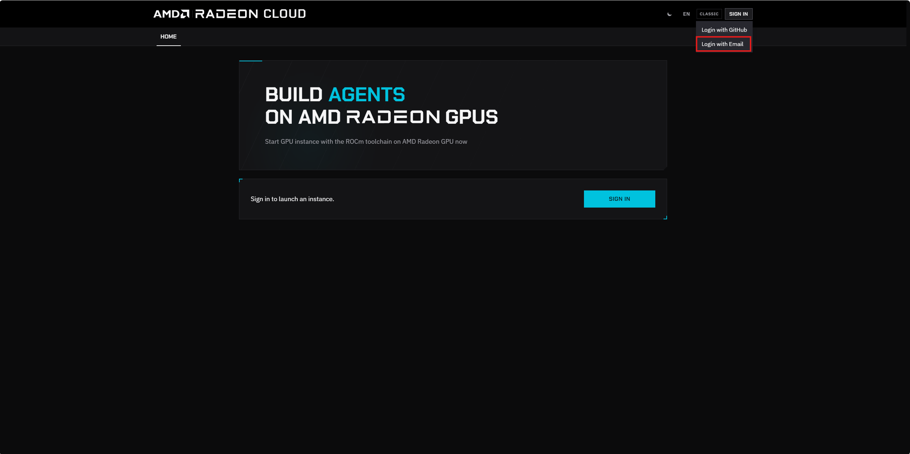
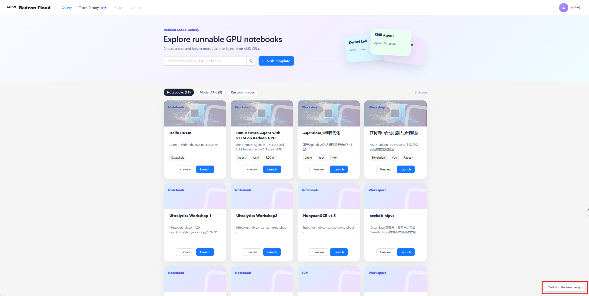
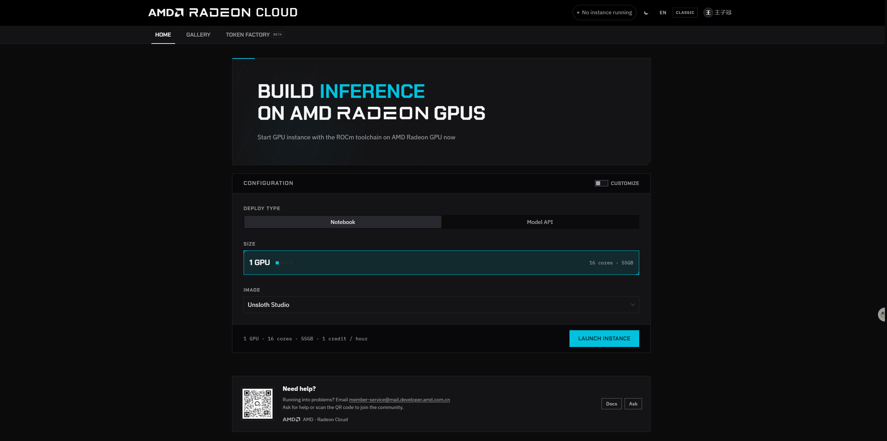
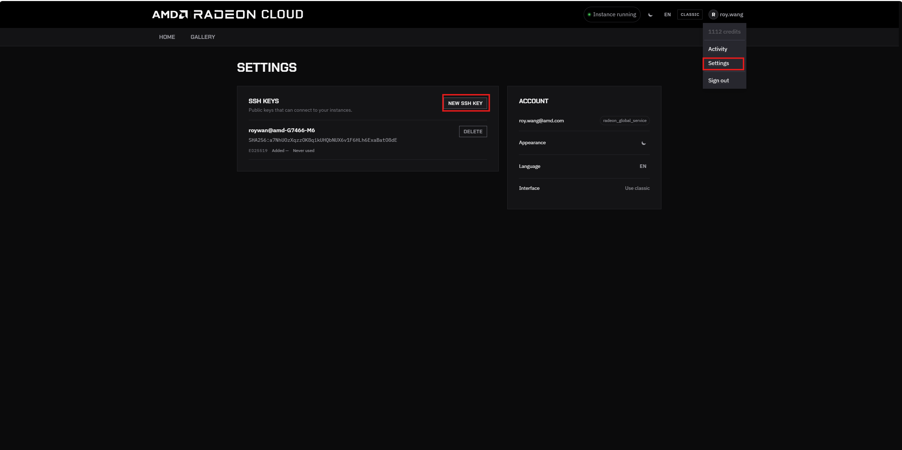
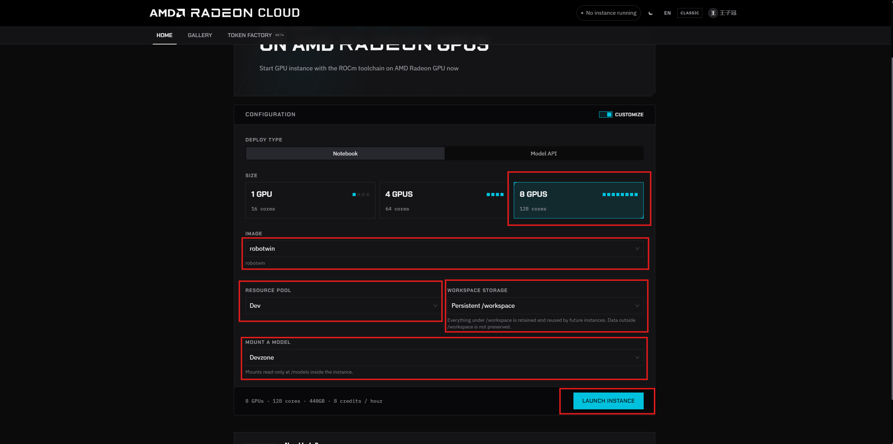
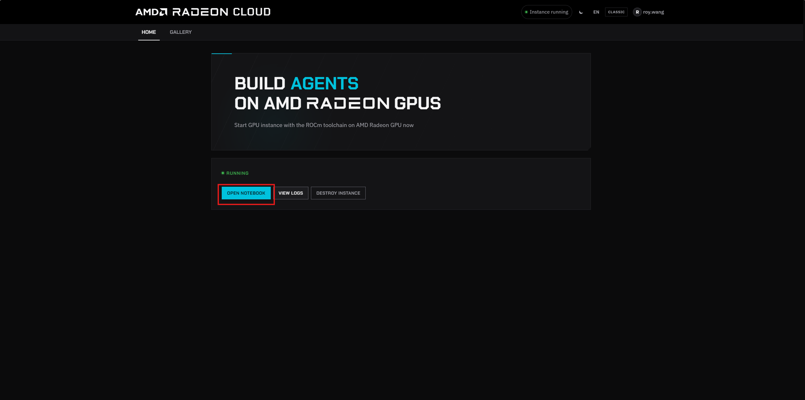
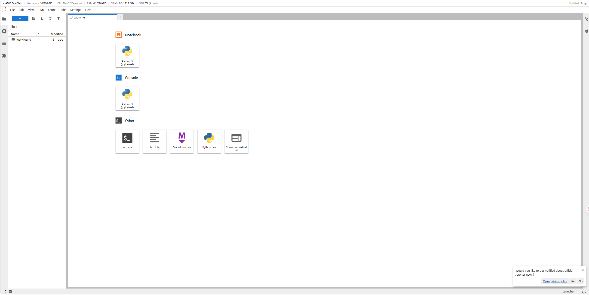
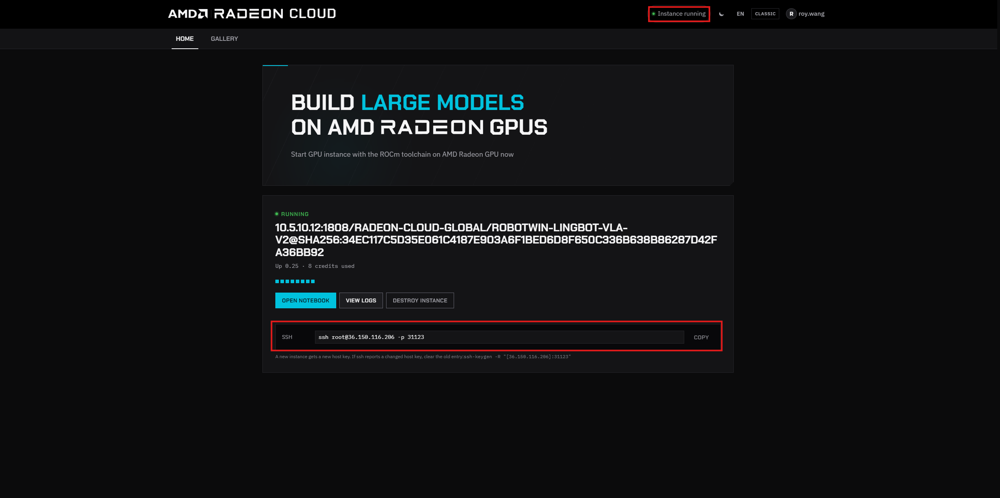
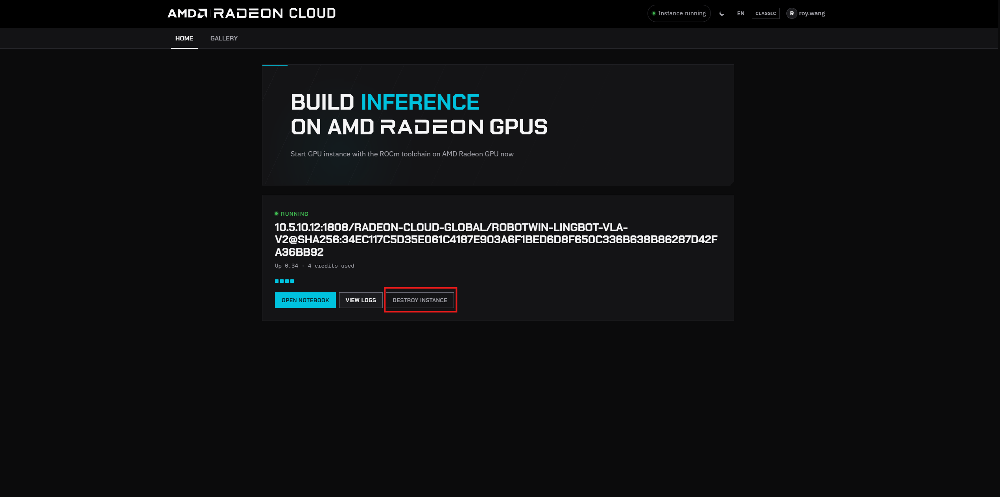

# Radeon Cloud 用户指南

[English version](./README_en.md)

本指南介绍如何在 [Radeon Cloud](https://developer.amd.com.cn/radeon/) 上申请 AMD Radeon GPU，并进入开发、训练和推理环境。

本文使用 `assets/` 目录中的最新界面截图；平台界面如有变化，请以实际页面为准。

## 1. 登录

打开 [Radeon Cloud](https://developer.amd.com.cn/radeon/)，点击 **Login → Login with Email** 完成登录。



### 切换到新版界面

用户登录后默认进入 **Classic** 风格界面。点击页面右下角的 **Switch to the new design**，切换到 **New** 风格。





### 添加 SSH 公钥

在 Profile 页面添加 SSH 公钥：

1. 如果本地还没有密钥对，请生成一组密钥（已有密钥可跳过）。macOS、Linux 和 Windows PowerShell 均可运行：

   ```bash
   ssh-keygen -t ed25519 -C "your_email@example.com"
   ```

   默认会生成 `~/.ssh/id_ed25519`（私钥）和 `~/.ssh/id_ed25519.pub`（公钥）。
2. 复制公钥内容：

   ```bash
   cat ~/.ssh/id_ed25519.pub
   ```

3. 点击 **Settings**，再点击 **New SSH Key**。
4. 将公钥粘贴到 SSH key 输入框，然后点击 **New SSH Key** 保存。



> ⚠️ 只能复制 `.pub` 公钥，绝不要上传或分享 `id_ed25519` 私钥。

## 2. 进入开发环境

登录后，在实例配置页面依次完成以下选择：

1. 点击 **Customize**。
2. 根据实际需求选择 GPU 数量，可选择 **4 GPUs** 或 **8 GPUs**。
3. 在 **Image** 中选择 **robotwin**。
4. 在 **Resource Pool** 中选择本次比赛对应的资源池 **Dev**。
5. 在 **Workspace Storage** 中选择 **Persistent /workspace**。
6. 在 **Mount a model** 中选择 **Devzone**。



配置完成后进入实例，待页面显示 **Your workspace is ready**，实例启动成功。

### 使用 JupyterLab

点击 **Open Notebook**，浏览器会打开 JupyterLab。在其中可以使用 Terminal、Notebook 和 File browser 完成开发工作。





### 使用 SSH

实例显示 **Instance running** 后，点击进入实例，再复制 SSH 窗口中的连接信息。使用本地终端连接：

```bash
ssh <user>@<host> -p <port>
```

请将 `<user>`、`<host>` 和 `<port>` 替换为页面显示的实际值。



## 3. 销毁实例

使用完成后进入 Profile 的 **Active Instance**，点击红色 **Destroy Instance**，避免实例继续消耗积分。



## 4. Robotwin 参考

可以参考 [Robotwin-radeon-cloud](https://github.com/ZiguanWang/Robotwin-radeon-cloud)，在 Radeon Cloud 上进行简单的 Robotwin 实验：

- **Robotwin closed-loop benchmark**：运行闭环任务并评估机器人策略表现。
- **LoRA training**：使用 LoRA 进行参数高效微调。
- **Full-parameter SFT training**：进行全参数监督微调训练。

具体环境配置、数据准备、训练命令和评测流程请以参考仓库说明为准。
